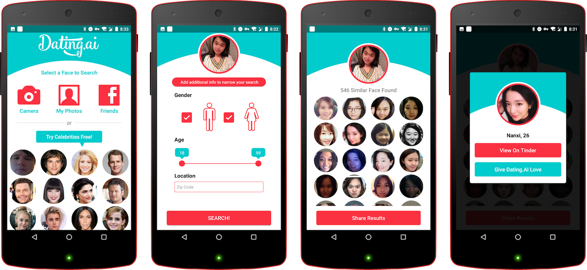

# Overview
I am a reliable senior mobile developer, I can make your iOS and Android Apps Elegant, Smooth, Funny and Great.

I started writing iOS apps in 2011, then I graduated in 2012 and got my Bachelor's Degree. I guess I started remote work officially from 2013 when my girl was born. I like tasting new technology, for example, I switched to the Swift language immediately when the Swift 0.1 was released. And I wrote my first Android app with Kotlin language before Google officially announced the Kotlin language as the first-class language on Android.

I use Vim to write code and Git to control code. RxSwift let me think everything as a stream, it also let me understand SwiftUI and Combine framework fast.

Besides mobile development, I am also interested in back-end development. In college, I learned PHP and Java for back-end development, but now I would like to use the Server-side Swift.

My Strengths:
✅ 100% Job Success
✅ 100% satisfaction from clients
✅ World-class quality and experience
✅ 24/7 available on Email or Skype
✅ 9+ years of iOS development experience
✅ 5+ years of Swift coding experience
✅ 5+ years of Remote work experience
✅ 2+ years of Kotlin coding experience
✅ Use Vim, RxSwift and RxJava to get the fast development speed and steady productions.
# Job Success Score on Upwork

# Work Feedback

We love how smooth the all photos section scrolls and how fast it loads the photos in. We really appreciate you taking the time to make sure you code the apple app to work as efficiently as possible.

***

Amazing developer. He can do iOS and Android. This time, he ported our iOS app into Android from source code. He is trustworthy and responsive. Will continue to work with him.

***


Great developer, excellent communication, will use again.

***


Vale is very professional, knowledgeable, helpful, and responsive. He delivered good quality work in a short amount of time. He was extremely helpful working through configuration issues after software was completed.

***


Vale is very professional, knowledgeable, helpful, and responsive. He delivered good quality work in a short amount of time. He was extremely helpful working through configuration issues after software was completed.

***


Tuchangewei easily understood our requirements, quoted a very reasonable number of hours. He completed the job correctly ahead of schedule. He is easy to communicate with and I reccomend him for future jobs relating to Xcode Swift on iOS.

***


This freelancer is knowledgeable, responsive and eager to do the job. He asked the relevant questions to further the job and took an interest in the project like a team member. Would highly recommend this freelancer and hire him again for future projects.

***


Everything works exactly like I wanted. The project was delivered correctly and quickly.  This was also the only person that wrote a tailored response to my project request. It was clear that he understood what I needed and was ready to get it done. Would absolutely use him again.

***


Good work and communication. He was proactive and helpfull. Testing of the app worked smooth. He solved the problems which occured in the project appropriate. I am satisfied and would recommend him for a similar job.

***


Very good guy to work with. He help put the UI/UX of the app in code and pushed it to my iPhone. We went over the details until we got the whole thing working. He id lots of work to make sure that I get exactly I was after. His communication is brilliant even though we have 12hour time difference.   Will definetley be working with him again and recommending him as a 5/5 service provider.


You can find more work feedback from [My Upwork Profile](https://www.upwork.com/freelancers/~01eeefc89751549361)
# Portfolio

*Name: Holocam2*
*Keyword: Swift, iOS, ConstraitLayout, RxSwift, Realm database, Gesture, AR, SceneKit*
*Link: https://apps.apple.com/us/app/holocam/id1271485980*

*Name: Pixeltopia*
*Keyword: Swift, iOS, ConstraitLayout, RxSwift, Realm database, Gesture, Drawing*
*Link: https://apps.apple.com/us/app/pixeltopia/id1478461880*

***
*Name: Scoutek*
*Keyword: Swift, iOS, ConstraitLayout, RxSwift, Realm database*
*Link: https://apps.apple.com/us/app/scoutek-camera-management/id1261889329*

***
*Name: Text to Speech*
*Keyword: Swift, iOS, ConstraitLayout, RxSwift, Realm database*
*Link: https://apps.apple.com/us/app/text-to-speech/id322329515*

***

*Name: Dating.AI*
*Keyword: Kotlin, Android, ConstraitLayout, Anko, Firebase.*
*Link: https://play.google.com/store/apps/details?id=dating.ai.find.face.date.app.meet.hookup.love.search.dating.apps.free.nearby.match.searching.straight.or.gay.on.tinder.and.pof*

***

*Name: Talkz*
*Keyword: Swift, iOS, ConstraitLayout, Audio, Video, Facebook SDK, Push, Universal app, iMessage App*
*Link: https://itunes.apple.com/us/app/talkz-for-messenger-emoji/id632731625?mt=8*

***

*Name: Sly Messenger*
*Keyword: Swift, iOS, ConstraitLayout, Audio, Video, Layer SDK, Parse.com platform, Push*
*Link: https://itunes.apple.com/cn/app/sly-messenger/id1044865073?mt=8*

***

*Name: Job Sight*
*Keyword: Swift, iOS, ConstraitLayout, Photo, AWS SDK, Push, Universal app, Background-transmission, Sqlite*
*Link: https://itunes.apple.com/us/app/job-sight/id1122668726?mt=8*

***
*Name: 海尚搜*
*Keyword: Swift, iOS, ConstraitLayout, Photo, Weibo SDK, Instagram SDK*
*Link: https://itunes.apple.com/cn/app/hai-shang-sou/id1033452244?mt=8*

***
*Name: GoWireless*
*Keyword: Swift, iOS, ConstraitLayout, Photo, Push, Universal app, Background-transmission, Sqlite*
*Link: https://itunes.apple.com/us/app/gowireless-camera-management/id1004081185?mt=8*

***
*Name: Calvin*
*Keyword: Object-C, iOS, Event Management*
*Link: https://www.calvinapp.com*

***
*Name: Oral medicin*
*Keyword: Object-C, iOS 4.0, Offline-Read*
*Link: https://itunes.apple.com/cn/app/oralmedicin/id714335041?l=en&mt=8*

***
*Name: Wi-Fi Disk*
*Keyword: Object-C, iOS 4.0, Smart Disk, Document, Video, Audio, Photo*
*Link: https://itunes.apple.com/cn/app/wi-fi-storage/id741563168?l=en&mt=8*

***
*Name: WeiDi*

*Keyword: Object-C, iOS 4.0, GPS, LBS*

