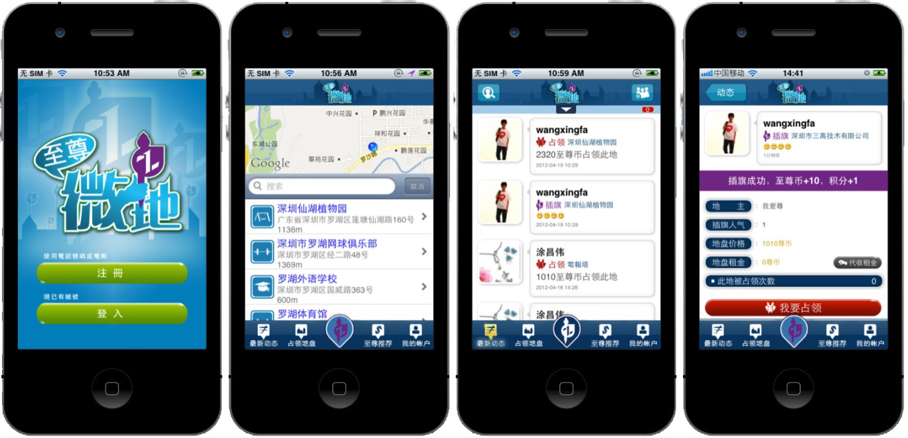

# Overview
*Hello, welcome to my technology blog. I am Changwei, I am a full-time freelancer and have 6+ years iOS development experience, meanwhile I develop Android apps.*

*If you have a good idea and want to talk with a professional mobile developer, don't hesitate, contact me via [Upwork Profile](https://www.upwork.com/o/profiles/users/_~01eeefc89751549361/).*
# Client Review

Amazing developer. He can do iOS and Android. This time, he ported our iOS app into Android from source code. He is trustworthy and responsive. Will continue to work with him.

***


Great developer, excellent communication, will use again.

***


Vale is very professional, knowledgeable, helpful, and responsive. He delivered good quality work in a short amount of time. He was extremely helpful working through configuration issues after software was completed.

***


Vale is very professional, knowledgeable, helpful, and responsive. He delivered good quality work in a short amount of time. He was extremely helpful working through configuration issues after software was completed.

***


Tuchangewei easily understood our requirements, quoted a very reasonable number of hours. He completed the job correctly ahead of schedule. He is easy to communicate with and I reccomend him for future jobs relating to Xcode Swift on iOS.

***


This freelancer is knowledgeable, responsive and eager to do the job. He asked the relevant questions to further the job and took an interest in the project like a team member. Would highly recommend this freelancer and hire him again for future projects.

***


Everything works exactly like I wanted. The project was delivered correctly and quickly.  This was also the only person that wrote a tailored response to my project request. It was clear that he understood what I needed and was ready to get it done. Would absolutely use him again.

***


Good work and communication. He was proactive and helpfull. Testing of the app worked smooth. He solved the problems which occured in the project appropriate. I am satisfied and would recommend him for a similar job.

***


Very good guy to work with. He help put the UI/UX of the app in code and pushed it to my iPhone. We went over the details until we got the whole thing working. He id lots of work to make sure that I get exactly I was after. His communication is brilliant even though we have 12hour time difference.   Will definetley be working with him again and recommending him as a 5/5 service provider.


# Portfolio
*Name: Dating.AI*

*Keyword: Kotlin, Android, ConstraitLayout, Anko, Firebase.*

*Link: https://play.google.com/store/apps/details?id=dating.ai.find.face.date.app.meet.hookup.love.search.dating.apps.free.nearby.match.searching.straight.or.gay.on.tinder.and.pof*

***

*Name: Talkz*

*Keyword: Swift, iOS, ConstraitLayout, Audio, Video, Facebook SDK, Push, Universal app, iMessage App*

*Link: https://itunes.apple.com/us/app/talkz-for-messenger-emoji/id632731625?mt=8*

***

*Name: Sly Messenger*

*Keyword: Swift, iOS, ConstraitLayout, Audio, Video, Layer SDK, Parse.com platform, Push*

*Link: https://itunes.apple.com/cn/app/sly-messenger/id1044865073?mt=8*

***

*Name: Job Sight*

*Keyword: Swift, iOS, ConstraitLayout, Photo, AWS SDK, Push, Universal app, Background-transmission, Sqlite*

*Link: https://itunes.apple.com/us/app/job-sight/id1122668726?mt=8*

***
*Name: 海尚搜*

*Keyword: Swift, iOS, ConstraitLayout, Photo, Weibo SDK, Instagram SDK*

*Link: https://itunes.apple.com/cn/app/hai-shang-sou/id1033452244?mt=8*

***
*Name: GoWireless*

*Keyword: Swift, iOS, ConstraitLayout, Photo, Push, Universal app, Background-transmission, Sqlite*

*Link: https://itunes.apple.com/us/app/gowireless-camera-management/id1004081185?mt=8*

***
*Name: Calvin*

*Keyword: Object-C, iOS, Event Management*

*Link: https://www.calvinapp.com*

***
*Name: Oral medicin*

*Keyword: Object-C, iOS 4.0, Offline-Read*

*Link: https://itunes.apple.com/cn/app/oralmedicin/id714335041?l=en&mt=8*

***
*Name: Wi-Fi Disk*

*Keyword: Object-C, iOS 4.0, Smart Disk, Document, Video, Audio, Photo*

*Link: https://itunes.apple.com/cn/app/wi-fi-storage/id741563168?l=en&mt=8*

***
*Name: WeiDi*

*Keyword: Object-C, iOS 4.0, GPS, LBS*

